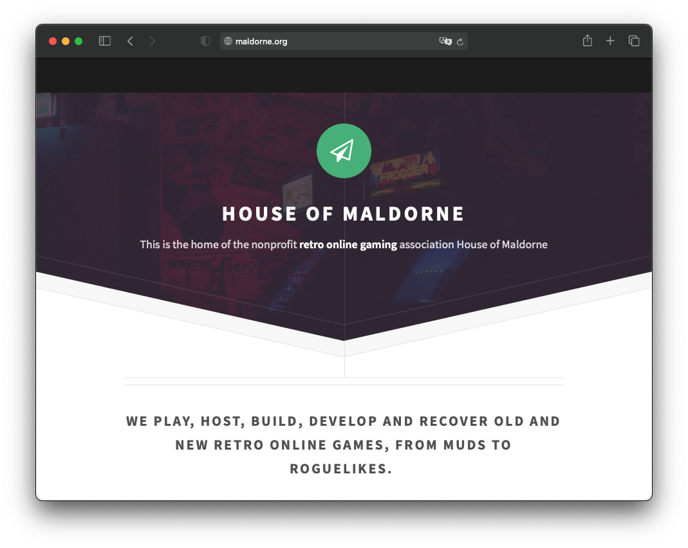
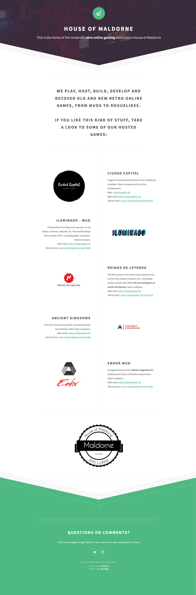

:warning: This is the repository for the old [maldorne.org](https://maldorne.org/) web, now deprecated. See [the new repository](https://github.com/houseofmaldorne/maldorne.org) instead.

## maldorne.org static page, made by Ivan Alonso ([@neverbot](https://github.com/neverbot))

Based on the [Directive Template](https://html5up.net/directive) by [HTML5 UP](https://html5up.net) | aj@lkn.io | [@ajlkn](https://twitter.com/ajlkn)

### License:

[Creative Commons Attribution 3.0](license.txt)

### Other licenses:

 * Head image by [Ben Neale](https://unsplash.com/@ben_neale) on [Unsplash](https://unsplash.com/photos/zpxKdH_xNSI) (free use/public domain)
 * Icons from [Font Awesome](http://fontawesome.io/) v5.8.1 (Icons: CC BY 4.0, Fonts: SIL OFL 1.1, Code: MIT License)
 * [jQuery](http://jquery.com/) v3.3.1 from jQuery Foundation (MIT License)

### Full screenshot:

